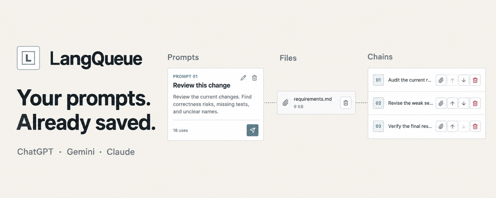
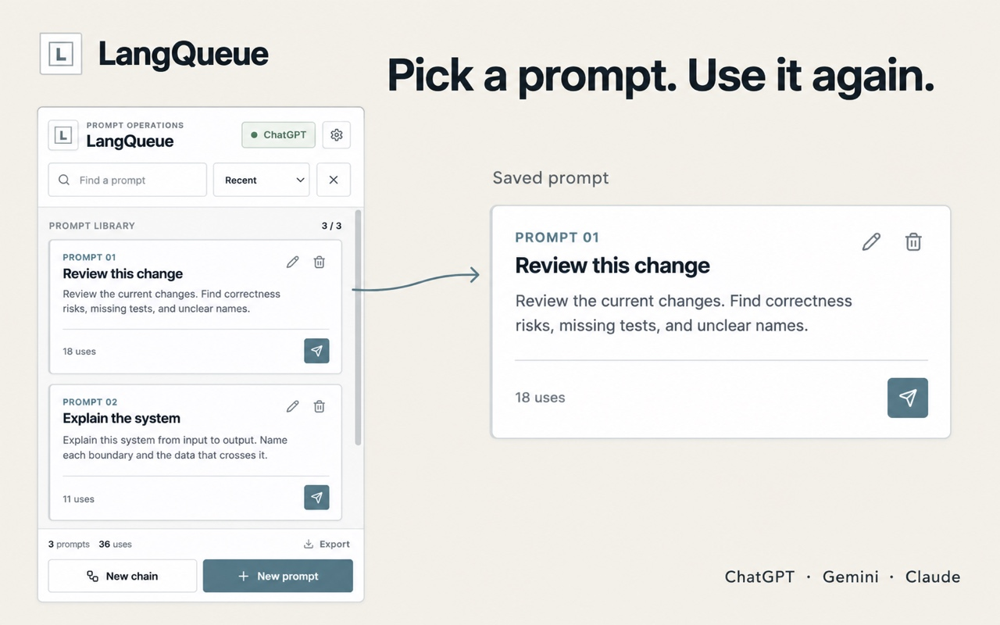
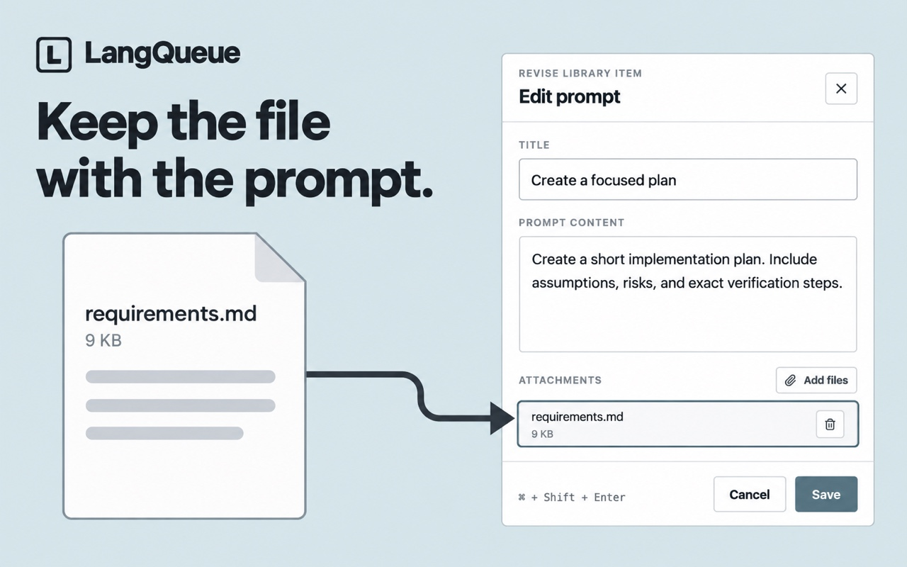
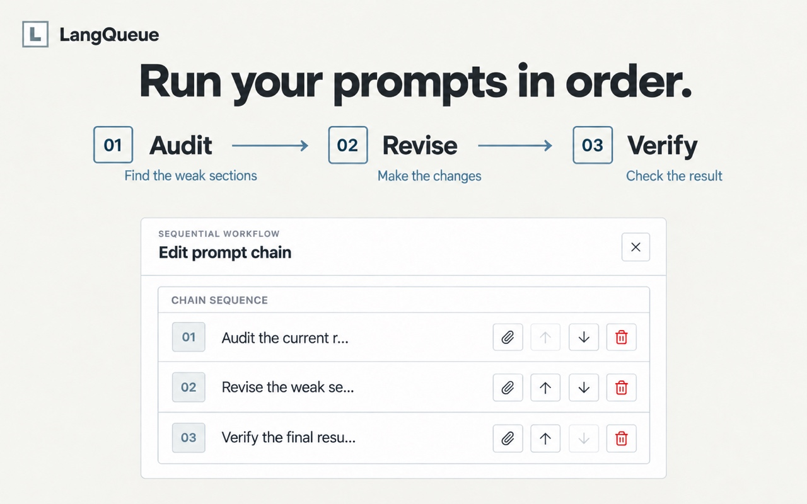

## LangQueue

A Chrome extension to streamline LLM workflows on ChatGPT, Gemini, and Claude by enabling storage, insertion, and queuing of multi-modal prompt chains.

  

  
  
  

### Capabilities

- **Shortcut suggestions**: Type `$` in supported chats to search saved prompts; insert with Tab or click. The suggestions anchor above the input to stay out of the way.
- **Prompt editor**: Edit or delete prompts from the shortcut suggestions in a centered dialog without opening the extension popup.
- **Prompt insertion**: Replaces the entire input with the saved prompt for predictable, clean insertion.
- **Queue while generating**: Press Enter during generation to queue the prompt and auto‑send once the model is idle.
- **Prompt chains**: Run multi‑step sequences with optional delays and auto‑send.
- **Page tweaks**: Optional behavior changes like preventing auto‑scroll on submit.
- **Import from Claude or ChatGPT skills**: Bring skills folders from Claude Code or Codex, plus any Markdown prompt files, into the library from the first‑run page or from Settings. Each `SKILL.md` becomes one prompt titled from its frontmatter `name`.
- **Privacy**: All data stays in local Chrome storage; no external services.

### Supported sites

- ChatGPT (`chat.openai.com`, `chatgpt.com`)
- Claude (`claude.ai`)
- Google Gemini (`gemini.google.com`)

### Tech stack

- TypeScript, React 18, Vite, `@crxjs/vite-plugin`
- Tailwind CSS for popup UI; Shadow DOM for shortcut suggestions and prompt editor isolation
- Chrome Extension Manifest V3, content scripts, service worker background, Chrome storage APIs

### Architecture

LangQueue is content‑script‑first. The in‑page controller handles shortcut trigger detection, shortcut suggestions, the prompt editor, prompt insertion, queueing, chain execution, and page tweaks. The background service worker stays thin and only coordinates storage and messaging. The popup is a lightweight library surface rather than the primary interaction model.

- Content script: `src/content` (shortcut trigger detection, shortcut suggestions, prompt editor, insertion, queue, chains, tweaks).
- Site adapters: `src/content/adapters` (ChatGPT, Claude, Gemini DOM heuristics and send/generate detection).
- Background: `src/background/index.ts` (settings, prompt search, usage logging, updates/deletes).
- Prompt library: `src/library` (prompt, chain, settings, and attachment storage, plus Markdown prompt file parsing).
- Messaging: `src/messaging` (request types and the send and listen helpers shared by the popup, worker, and content script).
- Popup UI: `src/popup` (library view and minimal settings).
- Onboarding page: `src/onboarding` (first‑run welcome and Markdown import).
